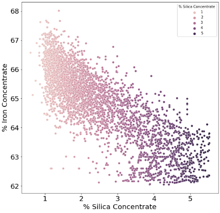
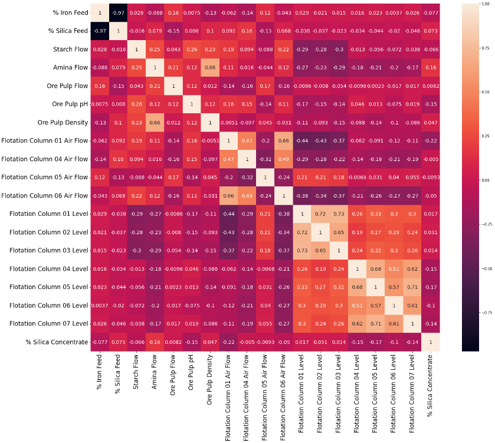
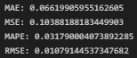
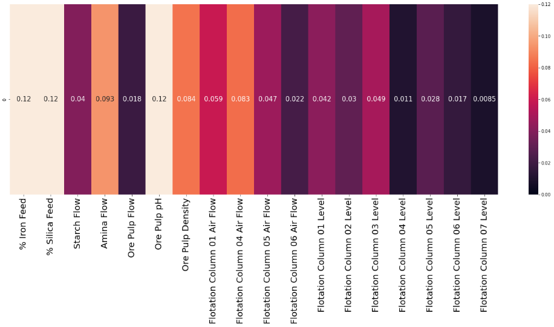

# **Modelo de predicción de calidad del mineral de hierro en un proceso de minería**

-----
*En este repositorio se ha usado git lfs para las carpetas de data y model ya que los archivos csv y los modelos eran demasiado grandes, para usar los modelos y archivos csv se tendrán que descargar desde github*
### Objetivo: Este es un proyecto en el que voy a encontrar un modelo que predica el porcentaje de sílice(impureza) que contiene un mineral después de haber sido sometido a los procesos de una planta de flotación.La pureza del mineral se puede obtener manualmente con una medida de laboratorio pero tardan al menos una hora en conseguirla, pudiendo preveer el porcentaje de pureza que tendrá el mineral al final del proceso lso ingenieros pueden tomar medidas preventivas reduciendo la impureza e impidiendo el desperdicio de porcentaje de mineral

-----

### Organización de carpetas: 

* scr/
    * data/: Contiene los archivos en formato csv usados en el proceso.
    
    * Images /: Contiene imágenes usadas en este archivo Markdown y en "proyect_resume.ipynb"

    * model/: Contiene los modelos exportados("my_model" es el modelo final elegido).

    * notebooks/: son archivos jupyter notebook usados en todo el proceso.

    * train.py/: Es el script que contiene solo los pasos para obtener el mejor modelo.

### Fuente: [Kaggle](https://www.kaggle.com/datasets/edumagalhaes/quality-prediction-in-a-mining-process)

------
## **Importación de los datos**

### El dataset utilizado contaba con 737453 registros y unas 24 columnas inicialmente, sin datos nulos y con los datos en tipo texto. Estas son algunas de las 23 variables que tenían los datos tras eliminar la columna de la fecha y transformar los datos a tipo numérico:

### La variable a predecir es "% Silica Concentrate" y como se ve en la imagen, el porcentaje del mineral de hierro y el porcentaje de sílice antes del proceso están muy correlados y parece no tener mucha relación con la pureza que tendrán al final.

## **Análisis de los datos**

## *Distribución de los datos*

### Aquí podemos ver como nuestros datos de la variable objetivo se concentran en valores que están entre 3 y 1.5. Podemos vre que tenemos unos cuantos valores atípicos por encima de 5 pero no se alejan demasiado

### Este es un gráfico de densidad con el que podemos apreciar de otra manera la distribución de los datos de la variable que queremos predecir. Como vemos, los datos se concentran en los mismos valores anteriormente dichos.

## *Correlación entre las variables*

### Podemos ver que hay ciertas correlaciones que son de variables que son partes del proceso muy parecidas así que esas las ignoraremos. También vemos que no hay ninguna variable que tenga una correlación fuerte con la concentración de sílice aunque la que tiene mayor relación es la variable del flujo de amina(Amina Flow)

### Podemos ver una correlación de 0.66 "Amina Flow" y "Ore Pulp Density" así que vamos a ver cómo se correlan.

### Se puede observar que hay una correlación tal vez logaritmica entre estas dos variables y como vimos antes, la variable Amina Flow es la que más correlación tiene con la variable objetivo.

## *Correlación con la variable objetivo*

### Ahora vamos a realizar un análisis la variable más importante con respecto a la concentración de sílice final.

### En la imagen vemos cierto direccionamiento de los valores pero nada realmente muy notable(recordemos que tiene una correlación de solo 0.66).

## **Modelo Final**

> ### Probamos
   * Regresión Lineal
   
      
      * Ridge
      
         
      * Lasso
      
         
      * ElasticNet

         
   * Arbol de decisiones

      
   * RandomForest

      
------
### También probamos

   * ExtraTreeRegressor

   * SVC

   * KNN

   * Modelos aplicando Grid Search y Cross Validation

### Al final el mejor modelo es un Random Forest que fue encontrado con un RandomSearch.

### La primera métrica indica el error absoluto medio que indica que de media las predicciones se desvían un 0,08 del resultado real mientras que con la segunda métrica podemos ver que normalmente no vamos a tener ningún error grande. La tercera métrica es el error porcentual absoluto medio indicando un error de un 0.04% de error y el último error indica la raíz del error cuatrático medio con un valor de 0,01.

### El mejor modelo que hemos obtenido ha sido usando el algoritmo de random forest(un modelo ensamblado que usa varios modelos de arboles de decision). Vamos a visualizar el comienzo de uno de estos arboles de decisiones.

### Los arboles de decision se basan en muchas elecciones en base a diferentes criterios que llevarán a crear diferentes ramas dependiendo de todas las elecciones que hayan para que al final se tome una decisión final con respecto al valor de la variable a predecir. Como se ve en la imagen, se va evaluando si un valor de una variable es mayor o menor a otro y dependiendo de esta evaluacion se va a una rama u a otra sucesivamente hasta llegar a un nodo final que nos indicará el resultado.

## Feature Importance

### Por último vamos a ver las variables con mayor implicación a la hora de que el modelo realice sus predicciones.

### Puedes ver que las variables con mayor correlación fueron % Iron Feed y % Silica Feed y luego serían Ore Pulp pH, la cual no me esperaba que tuviera tanta importancia, y Amina Flow

